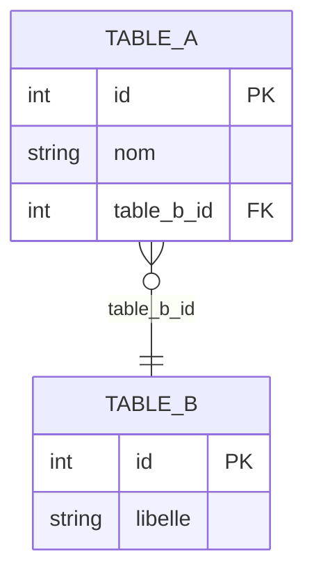

# Génération Diagramme ER

Lit les modèles de données et produit un diagramme entité-relation dans `docs/`.

## Processus

### 1. Lire CLAUDE.md
Identifier `{{schema_source}}` (répertoire des modèles ORM, fichiers de migration, schéma Prisma, fichiers SQL DDL, fichiers DBML…) et le format de sortie préféré (`mermaid erDiagram`, `PlantUML`, `dbml`).

### 2. Lire toutes les sources de schéma

Adapter à `{{schema_source}}` :
- **ORM** : lire chaque fichier modèle, extraire noms de tables, colonnes, types, contraintes (PK, FK, NOT NULL, UNIQUE), relations
- **Prisma** : lire `schema.prisma`, extraire les `model`
- **SQL DDL** : parser les `CREATE TABLE`
- **Migrations** : reconstituer le schéma final depuis l'ensemble des migrations dans l'ordre

Pour chaque entité, extraire :
- Nom de la table
- Colonnes : nom, type SQL normalisé, PK/FK/nullable/unique
- Relations : cardinalité (1-1, 1-N, N-N), clé étrangère

### 3. Générer le diagramme Mermaid (défaut)



Conventions :
- PK en premier, FK ensuite, colonnes métier, timestamps (`created_at`, `updated_at`) en dernier
- Cardinalité Mermaid : `||--o{` (1-N), `||--||` (1-1), `}o--o{` (N-N)

### 4. Écrire le fichier de sortie
Créer ou mettre à jour `docs/specs/mpd.md` (ou chemin défini dans CLAUDE.md) :

```markdown
# Schéma de base de données

> Généré depuis `{{schema_source}}`. Ne pas éditer manuellement.
> Dernière mise à jour : {date}

## Diagramme ER

```mermaid
...
```

## Tables ({N} tables)

| Table | Colonnes | Relations sortantes |
|---|---|---|
```

### 5. Signaler les incohérences
- FK sans relation déclarée (ou l'inverse)
- Tables orphelines (aucune relation)
- Colonnes de même nom dans plusieurs tables avec types différents

## Règles

- Ne jamais modifier les fichiers sources (modèles, migrations, schéma) — lecture seule
- Toujours lire l'état courant — ne pas se fier à un diagramme précédent
- Mettre à jour le diagramme existant plutôt qu'en créer un nouveau si `mpd.md` existe déjà
